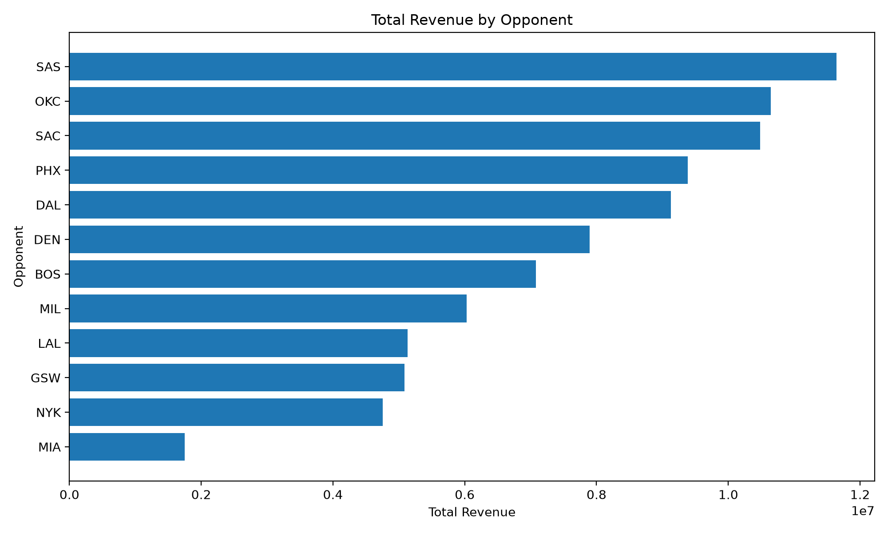
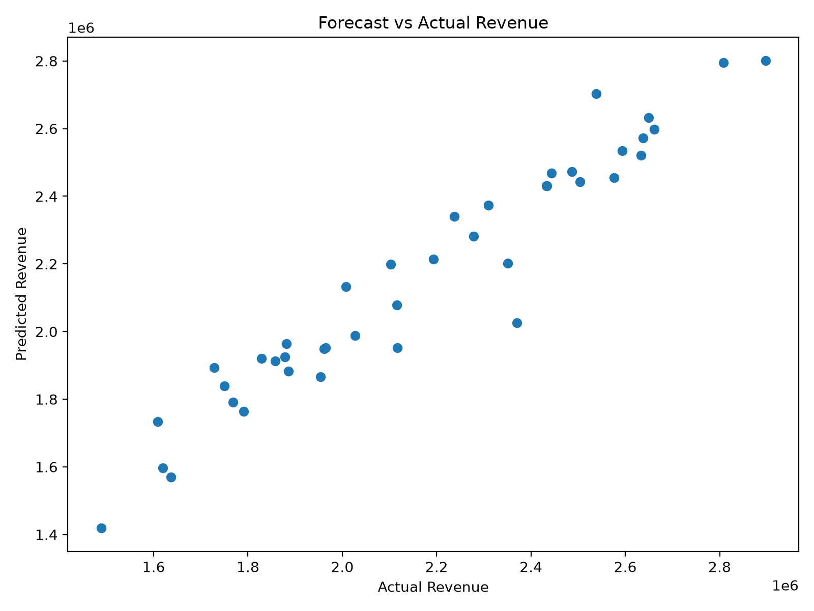
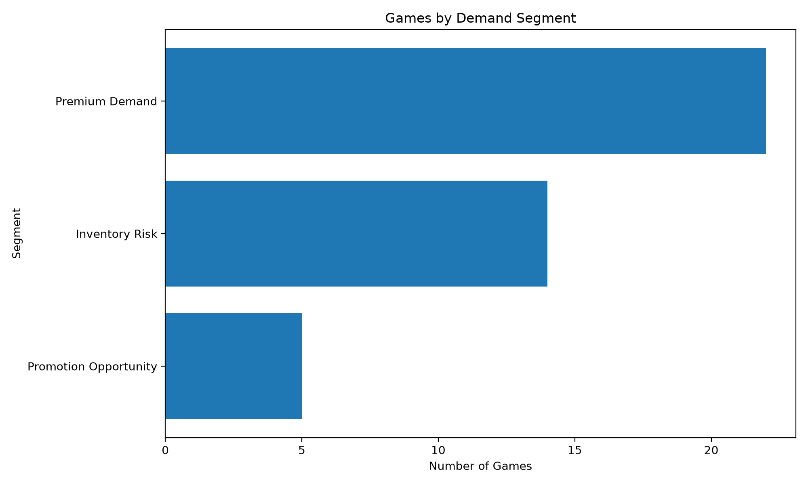
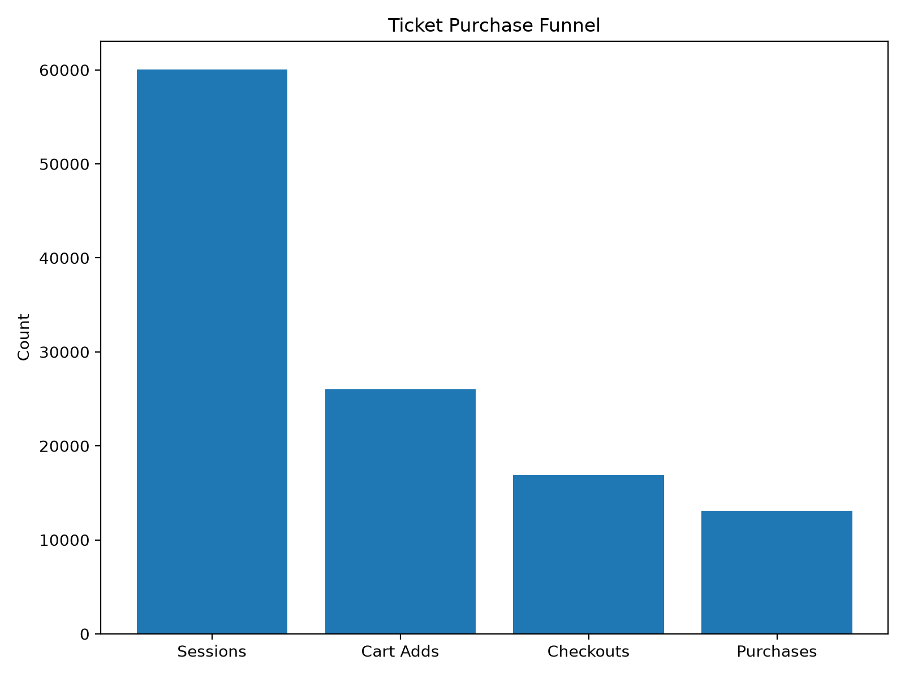

# 🏀 NBA Revenue Intelligence

An end-to-end sports analytics platform that simulates NBA ticketing operations using Python, SQL, machine learning, and business intelligence to support revenue optimization and executive decision-making.


## Project Highlights

- 25,000 simulated customers
- 200,000+ ticket transactions
- 60,000+ web sessions
- 41 NBA home games
- End-to-end ETL pipeline
- Star schema warehouse
- Machine learning forecasting
- Power BI executive dashboards

## Business Problem

Professional sports organizations continuously balance ticket pricing, inventory management, marketing spend, and fan engagement to maximize revenue.

This project demonstrates how an end-to-end analytics platform can transform operational ticketing data into actionable insights that support pricing strategy, demand forecasting, promotional planning, and executive decision-making.

## Overview

The platform demonstrates a complete analytics workflow spanning:

- Data simulation
- Python ETL
- SQL data warehousing
- Feature engineering
- Machine learning
- Executive KPI reporting
- Power BI dashboards

<details>
<summary><b>Data Sources</b></summary>

The platform combines **real NBA schedule data** from `nba_api` with a **synthetic operational dataset** that simulates the ticketing, pricing, marketing, and customer activity of a professional NBA organization.

- **Real NBA Data:** Schedule, teams, opponents, and game dates.
- **Synthetic Operational Data:** Ticket transactions, customer demographics, seating inventory, dynamic pricing, promotions, website activity, purchase funnel events, and revenue metrics.

</details>

## Pipeline


## Technology Stack

| Category | Technologies |
|-----------|--------------|
| Programming | Python 3 |
| Data Processing | pandas, NumPy |
| Database | SQLite (Designed for PostgreSQL Migration) |
| SQL | Star Schema Design, SQL Views, Analytical Queries |
| Machine Learning | scikit-learn (K-Means Clustering, Linear Regression) |
| Data Source | `nba_api` |
| Visualization | Power BI, Matplotlib |
| Testing & Quality | Pytest, Ruff, Black |
| Development | Git, GitHub, GitHub Actions |

## System Architecture


## Data Warehouse

The platform uses a dimensional star schema to support analytical reporting and machine learning.

**Dimensions**
- Games
- Customers
- Sections
- Promotions

**Facts**
- Ticket Transactions
- Web Sessions

**Analytics Tables**
- Model Dataset
- Game Segments
- Revenue Forecasts
- Executive KPIs
- Executive Recommendations


---

## Analytics Outputs

The analytics pipeline automatically generates dashboard-ready datasets, machine learning predictions, executive KPIs, business recommendations, and visualizations.

<table>
  <tr>
    <td align="center">
      <b>Revenue by Opponent</b><br>
      
    </td>
    <td align="center">
      <b>Forecast vs Actual Revenue</b><br>
      
    </td>
  </tr>
  <tr>
    <td align="center">
      <b>Game Demand Segments</b><br>
      
    </td>
    <td align="center">
      <b>Ticket Purchase Funnel</b><br>
      
    </td>
  </tr>
</table>

---

## Analytics & Decision Support

The platform combines machine learning and business intelligence to support pricing, marketing, inventory management, and revenue optimization.

### Machine Learning

- K-Means demand segmentation
- Revenue forecasting
- Sell-through prediction
- Sellout probability estimation

### Executive KPIs

- Revenue
- Ticket Sales
- Average Ticket Price
- Inventory Remaining
- Sell-through Rate
- Conversion Funnel
- Cart Abandonment Rate

### Example Recommendations

| Scenario | Recommendation |
|----------|----------------|
| Premium Demand | Increase premium seating prices |
| Promotion Opportunity | Launch targeted marketing campaigns |
| Inventory Risk | Increase marketing and promotional efforts |
| High Cart Abandonment | Optimize the checkout experience |

## Project Structure

```text
NBA_RevenueIntelligence/
│
├── .github/              # CI/CD workflows
├── dashboard/            # Power BI dashboards & screenshots
├── data/
│   ├── analytics/        # Model outputs & KPIs
│   ├── external/         # External data sources
│   ├── raw/              # Raw datasets
│   └── warehouse/        # SQLite warehouse & tables
│
├── docs/                 # Project documentation & diagrams
├── notebooks/            # Exploratory analysis
├── output/
│   └── figures/          # Auto-generated visualizations
│
├── sql/
│   ├── analytics/        # Dashboard SQL queries
│   ├── schema/           # Database schema
│   └── tests/            # SQL quality checks
│
├── src/
│   ├── analytics/
│   ├── config/
│   ├── etl/
│   ├── models/
│   ├── simulation/
│   ├── utils/
│   ├── visualization/
│   └── warehouse/
│
├── tests/                # Automated unit tests
│
├── main.py               # End-to-end pipeline
├── pyproject.toml
├── requirements.txt
├── README.md
└── LICENSE
```

## Installation

```bash
git clone https://github.com/dorisavedikian/NBA_RevenueIntelligence.git

cd NBA_RevenueIntelligence

python -m venv .venv

# macOS/Linux
source .venv/bin/activate

# Windows
.venv\Scripts\activate

pip install -r requirements.txt

python main.py
```

Running `main.py` executes the complete analytics pipeline, including data generation, ETL, warehouse construction, feature engineering, machine learning, KPI generation, and executive recommendations.

## Future Enhancements

- Generalize the platform for any NBA team by externalizing team-specific assumptions into configuration files, including arena capacity, seating sections, pricing tiers, opponent demand weights, promotions, and schedule inputs.
- Migrate the data warehouse from SQLite to PostgreSQL.
- Deploy the analytics platform to Azure or AWS.
- Schedule automated pipeline execution using Apache Airflow.
- Extend forecasting models with advanced machine learning techniques.
- Package the platform as a reusable Python library for rapid deployment across NBA organizations.
